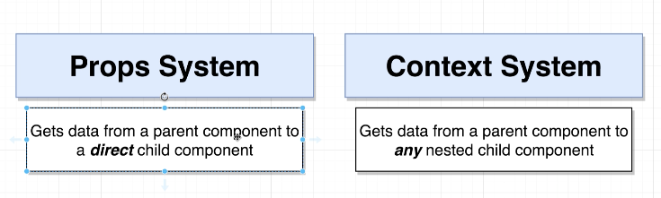
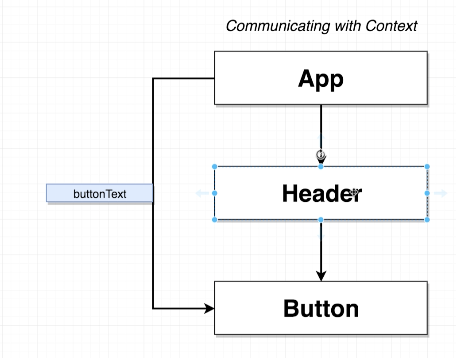
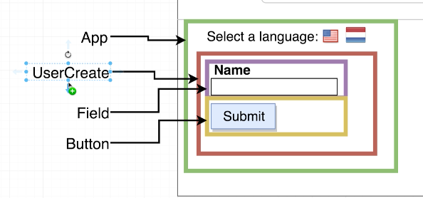
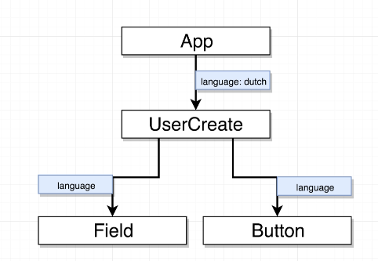
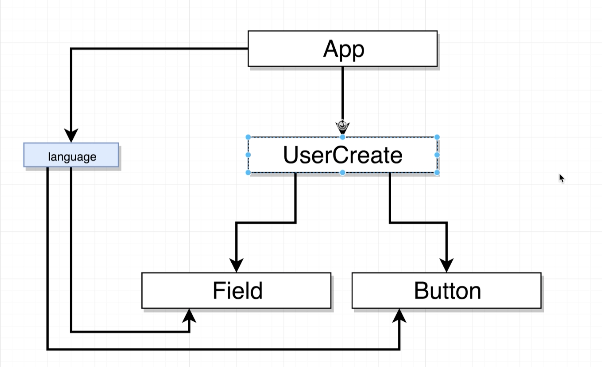

## Section - 23 The Context System With React
[Course Link](https://www.udemy.com/course/react-redux/learn/lecture/12823387?start=30#overview)

- Context is all about communicating information between different components much like props system, only different is - 

 

### App Layout

Using props system

Using Context System
