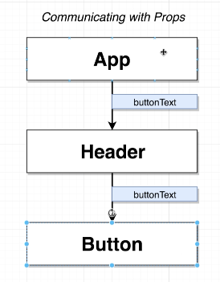
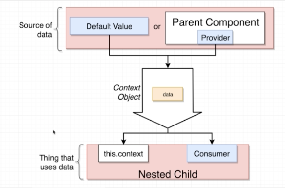

## Section - 23 The Context System With React
[Course Link](https://www.udemy.com/course/react-redux/learn/lecture/12823387?start=30#overview)

- Context is all about communicating information between different components much like props system, only different is - 

 


### App Layout

Clicking on flags will change the text in button and form to the country's language.

Using props system


Using Context System


Think of Context System as a pipeline. There are two ways to get information in and out of this pipeline!


Ways to get data in :
    - Default value
    - Provider

ways to get data out :
    - using this.context
    - using Consumer


**Creating a Context**
*context/LanguageContext.js*
```javascript
import React from 'react';

export default React.createContext('english);
```

**Getting data out using this.context**

*components/Button.js*
```javascript
import React from 'react';
import LanguageContext from '../contexts/LanguageContext';

class Button extends React.Component {
    static contextType = LanguageProvider;
    // The contextType is a special property name, 
    // if you call this anything else, this won't work!

    // use of 'static' means we are adding a property to
    // class itself and not creating any local version of it
    render() {
        const text = this.context=== 'english' ? 'Submit' : 'प्रस्तुत';
        return (
            <button class="ui button primary">{text}</button>
        );
    }
}

// Button.contextType = LanguageProvider
// This will work as well

export default Button;
```

**Sending data using provider**
*src/App.js*
```javascript
import LanguageContext from '../contexts/LanguageContext'
...
...
render() {
    return (
        <div className="ui container">
                ...
                ...
                <LanguageContext.Provider value={this.state.language}>
                    <UserCreate />
                </LanguageContext.Provider>
            </div>
    );
}

export default App;
```


**Getting data out using consumer**
*components/Button.js*
```javascript
import React from 'react';
import LanguageContext from '../contexts/LanguageContext';

class Button extends React.Component {
    renderSubmit(value) {
        return value === 'english' ? 'Submit' : 'प्रस्तुत';
    }
    render() {
        
        return (
            <button class="ui button primary">
                <LanguageContext.Consumer>
                    {(value) => this.renderSubmit(value)}
                </LanguageContext.Consumer>
            </button>
        );
    }
}

export default Button;
```


